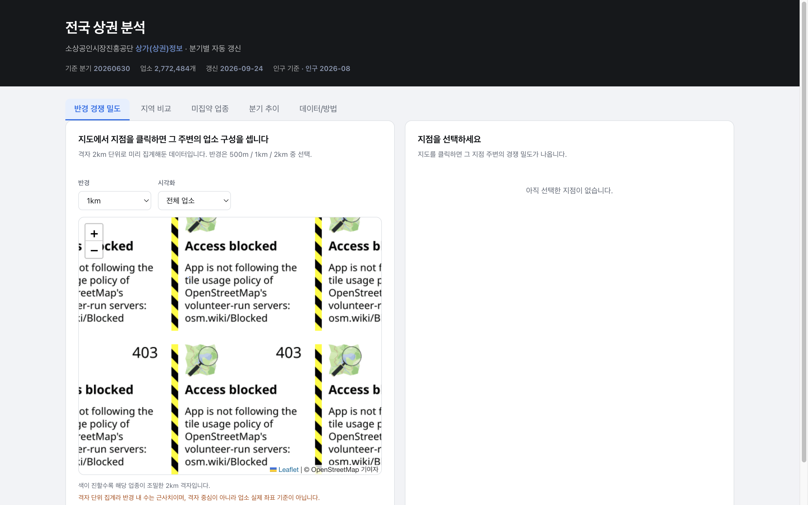
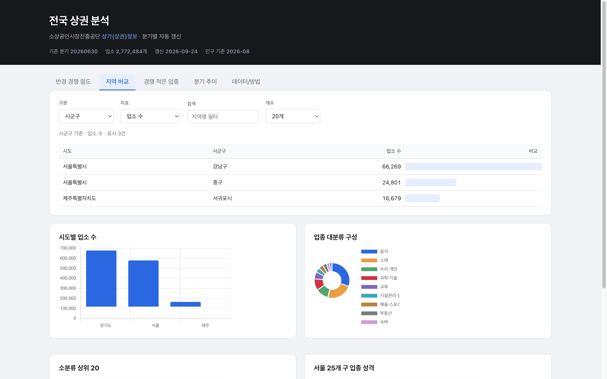
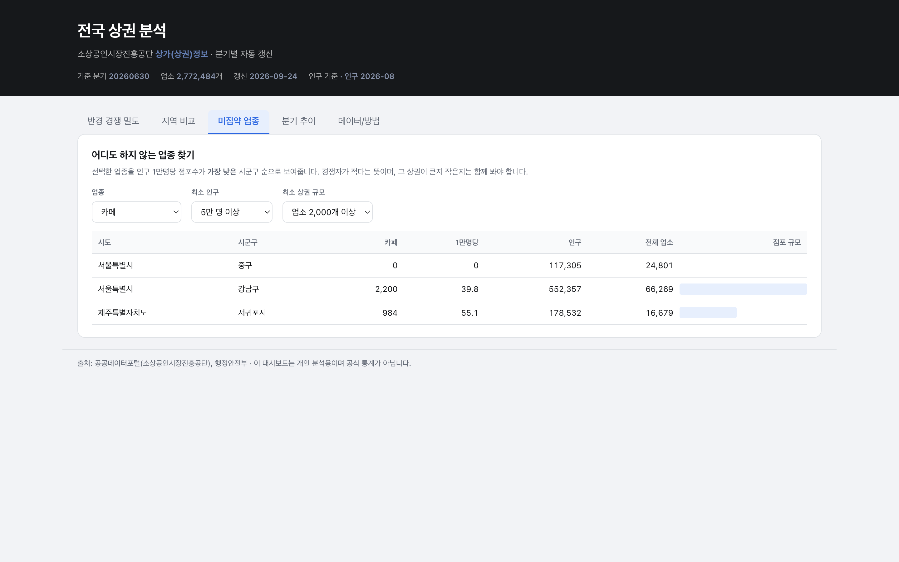

# 전국 상권 분석 대시보드

> 2,772,484개 상가업소를 분기마다 자동 갱신해 보여주는 개인 대시보드.
> 서버도 도메인도 월 비용도 없습니다.

[소상공인시장진흥공단 상가(상권)정보](https://www.data.go.kr/data/15083033/fileData.do)를
매주 확인해서 새 분기가 나오면 자동으로 내려받고, 집계해서 웹에 올립니다.
브라우저는 사전 집계된 JSON만 읽습니다.

**DataPopcorn · 이인영** · [datapopcorn.ai](https://datapopcorn.ai) · MIT License

---

## 왜 만들었나

공공데이터는 대부분 "파일이 있다"에서 끝납니다. 실제로 쓰려면 매번 353MB를 내려받고
엑셀로 열어야 하고, 다음 분기에 또 처음부터 해야 합니다. 이 저장소는 그 반복을 없애는
쪽입니다. 한 번만 설정하면 분기마다 알아서 갱신됩니다.

동시에, 이 데이터가 **답하지 못하는 질문**을 코드 안에 명시적으로 남겨뒀습니다.
폐업률을 이 파일 하나로 계산하려는 사람은 대체로 틀린 결론에 도달합니다.

## 화면

| 탭 | 하는 일 |
|---|---|
| **반경 경쟁 밀도** | 지도에서 지점을 클릭하면 그 주변 업종 구성(카페, 편의점, 치킨, 학원 등) |
| **지역 비교** | 시도/시군구와 업소 수, 인구당 밀도, 업종 비중을 자유 조합 |
| **경쟁 적은 업종** | 특정 업종의 1만 명당 점포수가 가장 낮은 지역 찾기 |
| **분기 추이** | 분기별 전체 업소 수와 업종 구성 변화 |
| **데이터/방법** | 출처, 갱신 방식, 이 데이터가 말해주지 못하는 것 |

### 반경 경쟁 밀도



### 지역 비교



### 경쟁 적은 업종



---

## 아키텍처

```
GitHub Actions (매주 월요일 06:00 KST)
  |
  1. data.go.kr 상세 페이지 파싱 -> 최신 분기 버전 확인
     같은 버전이면 SKIP (353MB를 불필요하게 다시 받지 않는다)
  |
  2. 2단계 다운로드: atchFileId 확보 -> ZIP 수신 (353MB)
     unzip. 파일명은 CP949로 저장돼 있어 그대로 풀면 깨진다
  |
  3. DuckDB 집계 (277만 행 x 39컬럼을 1분 안쪽에 처리)
     - 시군구, 행정동, 업종별 집계
     - 인구 결합 -> 1인당 밀도
     - 지도용 2km 격자 압축
     - 분기 스냅샷을 history.json에 누적
  |
  4. docs/data/dashboard.json 커밋
  |
  5. GitHub Pages 자동 배포
```

### 그래서 이 조합을 골랐다

| 선택 | 이유 |
|---|---|
| GitHub Actions | 서버 불필요. 유지비 0원 |
| GitHub Pages | 정적 파일이면 충분. DB 서버가 필요 없습니다 |
| DuckDB | pandas로는 277만 행을 1GB 넘게 올려야 하지만, DuckDB는 CSV를 직접 스트리밍해 메모리를 거의 쓰지 않습니다 (실측: 16개 CSV 47초) |
| 사전 집계 | 277만 점을 JSON에 담을 수 없습니다. 필요한 질문에 맞춰 미리 뭉어 브라우저 부담을 없앴습니다 |

## 구조

```
scripts/download.py           data.go.kr 2단계 다운로드 + CP949 unzip + 인구 XLS
scripts/build_aggregates.py   DuckDB 집계 -> dashboard.json
scripts/refresh.py            위 둘을 잇는 파이프라인
.github/workflows/refresh.yml 매주 크론 -> 검증 -> 커밋
docs/                         GitHub Pages가 서비스하는 화면 (Source: main / /docs)
docs/data/dashboard.json      자동 생성 (커밋 대상)
docs/colab-duckdb.ipynb    Colab 실습 노트북
```

## 실행 방법

```bash
pip install duckdb pandas requests lxml html5lib
python scripts/refresh.py
```

첫 실행은 353MB 다운로드 때문에 몇 분 걸립니다. 이후에는 ZIP를 재사용하므로
집계만 다시 돕니다.

GitHub Actions로 돌리려면 저장소를 push한 뒤
**Settings -> Actions -> 상권 데이터 자동 갱신 -> Run workflow** 로 수동 실행해 봅니다.

GitHub Pages 설정은 **Settings -> Pages -> Source: Deploy from a branch -> `main` / `/docs`** 입니다.

## 강의용 노트

수업에서 다룰 수 있는 순서입니다. 각 단계가 앞 단계만 알면 되는 구조입니다.

| 단계 | 다룰 것 | 파일 |
|---|---|---|
| 1 | 파일데이터 2단계 다운로드, `dataNm` 함정 | `scripts/download.py` |
| 2 | CP949 파일명, `read_csv` glob | `scripts/download.py` |
| 3 | DuckDB로 메모리 없이 대용량 집계 | `scripts/build_aggregates.py` |
| 4 | pandas로 하기 어려운 것 (인구 결합, 격자 압축) | `scripts/build_aggregates.py` |
| 5 | 배치 자동화, 산출물 검증, 실패를 조용히 넘기지 않기 | `.github/workflows/refresh.yml` |
| 6 | 해석의 한계를 UI에 함께 노출하기 | `docs/` |

Colab에서 DuckDB만 써보고 싶다면 [`docs/colab-duckdb.ipynb`](docs/colab-duckdb.ipynb)를
보세요. 서버 없이 파일 한 개로 SQL이 돌아가는 것을 확인할 수 있습니다.

## data.go.kr 다운로드가 왜 두 단계인가

파일데이터에는 숨겨진 URL이 없고, 순서대로 호출해야 합니다.

1. `POST /tcs/dss/selectFileDataDownload.do`
   `publicDataPk=15083033`과 `publicDataDetailPk`(분기마다 바뀜)를 넘기면
   `atchFileId`와 `fileDetailSn`이 나옵니다.
2. `GET /cmm/cmm/fileDownload.do?atchFileId=...&fileDetailSn=...&dataNm=<데이터명>`
   -> ZIP.

**`dataNm`을 빼면 HTTP 200을 주면서 바이트가 0개입니다.**
에러로 보이지 않아 "다운로드 실패"로 오해하기 쉬운 함정이라,
`download.py`는 응답이 100MB 미만이면 실패로 처리합니다.

## 이 데이터가 답하지 못하는 질문

대시보드의 "데이터/방법" 탭에도 같은 내용을 넣었지만, 여기서 한 번 더 분명히 합니다.

- **폐업률을 구할 수 없습니다.** 각 분기 시점의 영업 중 업소만 있는 스냅샷입니다.
  증감은 같은 상가업소번호를 기준으로 분기 간 비교해야 합니다.
- **브랜드 점유율은 추정치입니다.** 상호명에 포함된 문자열을 규칙으로 매칭했습니다.
  실제 점포 수와 다릅니다. 참고용으로만 쓰세요.
- **반경 밀도는 근사입니다.** 2km 격자로 미리 뭉어 둔 값이라 격자 경계 오차가 있습니다.
  정확히 필요하면 원본 CSV로 직접 집계하세요.
- **"소상공인"만 담긴 데이터가 아닙니다.** 프랜차이즈, 대형점, 임대점포도 함께 집계됩니다.
  실제로 등록된 소상공인 수와 차이가 있습니다.
- **인구는 주민등록 기준입니다.** 전입신고를 하지 않은 사람이 빠져 있어,
  유동인구가 많은 지역에서 실제 체류 인구보다 낮게 나옵니다.

## 자주 걸리는 문제

**dashboard.json이 안 생겨요**
`scripts/refresh.py`를 로컬에서 먼저 돌려보세요. 행정안전부 XLS의 열 이름이
예상과 다를 수 있습니다.

**JSON이 너무 커요**
`build_aggregates.py`의 grid 해상도(0.02도)를 키우거나 `dong` 항목 수를 줄이세요.
기본 경고선은 8MB입니다.

**지도가 안 떠요**
Pages Source가 `main` / `site`인지 확인하세요. `docs/`가 루트 밖이면 404입니다.

## 라이선스

코드: [MIT](LICENSE)

데이터:

- 상가(상권)정보: 공공데이터포털상 **이용허락범위 제한 없음**
- 주민등록 인구: 행정안전부
- 지도 타일: (c) OpenStreetMap contributors, ODbL